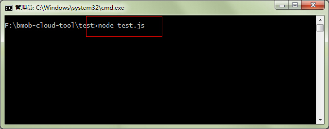
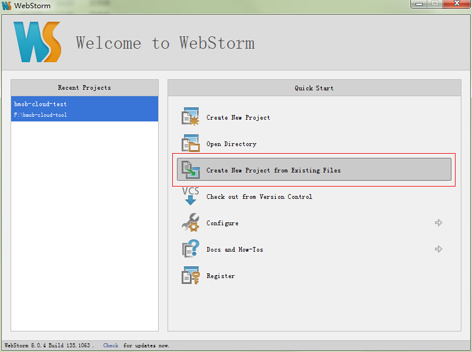
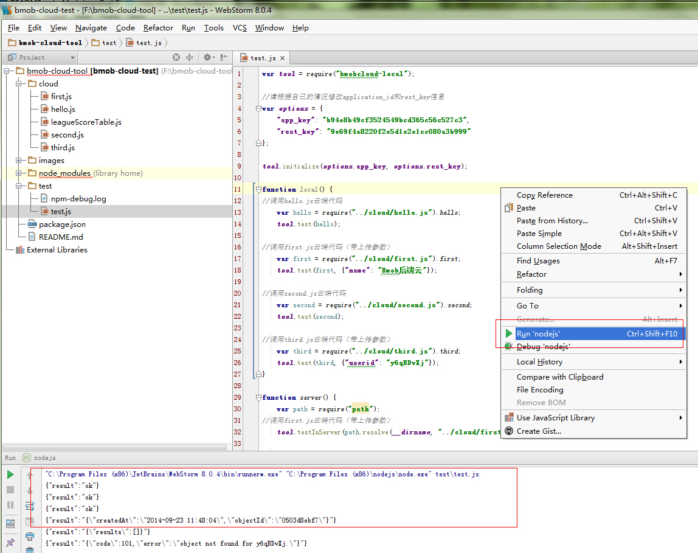

Bmob云端代码本地调试工具
=========================

提供这个开发工具是为了方便大家对云端代码进行调试，可以结合一些IDE和Node编译器更好的开发。

## 准备工作

1. 根据自己的操作系统的情况，下载并安装NodeJs编译器（http://www.nodejs.org/download/）。

2. Clone这个Repo的到本地电脑。

## 编写云端代码

1. 进入Repo的cloud文件夹，编写相应的云端代码（可参考我们提供的demo）。

2. 根据自己的APP信息，修改test文件夹下的`test.js`的`application_id`和`rest_key`信息。

## 命令行调试

1. 打开命令提示符工具，进入到Repo对应的test目录下。
2. 执行命令`node test.js`，即可看到调试信息。如下图所示：

## WebStorm IDE调试（推荐）

你还可以借助一些IDE工具进行云端代码的编辑和调试，下面以WebStorm（下载地址：http://www.jetbrains.com/webstorm/）为例进行阐述。

1. 导入Repo工程。

2. 修改NodeJs编译器的路径信息。过程如下：执行菜单Run->Edit Configurations，并修改NodeJs的安装路径，如下图所示

3. 打开test/test.js文件，右击鼠标，在弹出菜单中选择“Run 'nodejs'”，如果配置无误的话就可以看到调试结果了，如下图所示：

